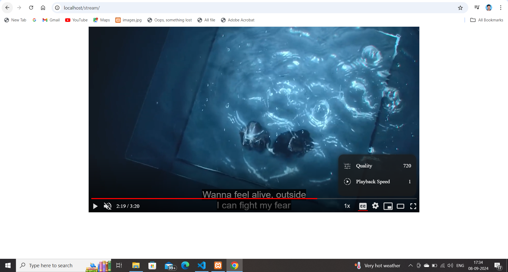
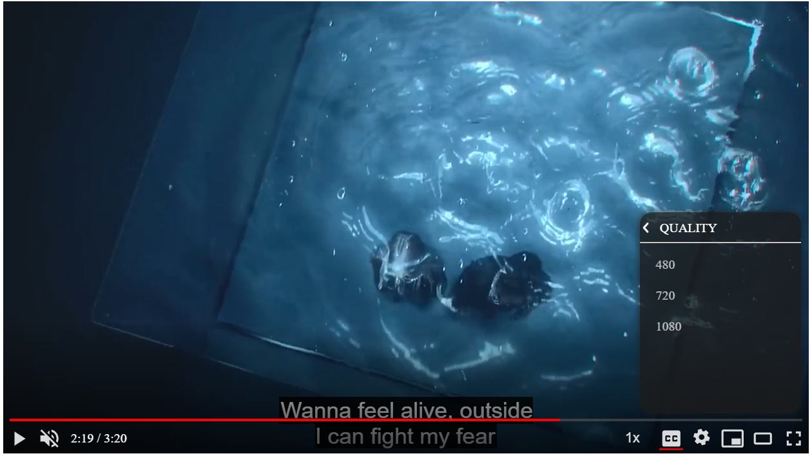

# Stream: A Custom Video Player with HLS Support

[](https://github.com/gourav-gk/stream)

Stream is a simple and customizable video player that supports HTTP Live Streaming (HLS). Built entirely using HTML, CSS, and JavaScript, it allows for seamless streaming of video content with adaptive bitrate playback using HLS.

## Features
- **HLS support**: Adaptive streaming using `.m3u8` files.
- **Custom Controls**: Play, pause, volume control,playback speed,quality setting,threatre mode and full-screen toggle.
- **Stylized Player**: Modern and responsive design with CSS customizations.
- **Cross-Browser Compatibility**: Works across modern web browsers.

## Screenshots
### Player Interface


### Fullscreen Mode


## Installation
1. Clone the repository:
   ```bash
   git clone https://github.com/gourav-gk/stream.git
2. Open index.php in web browser

## Technologies Used
- **HTML5**
- **CSS3**
- **JavaScript (Vanilla)**
- **HLS.js (for enabling HLS playback on browsers that do not natively support it)**

## Contributing
Feel free to submit pull requests or open issues to improve the player!

Built with ❤️ by Gourav Kumar
   
